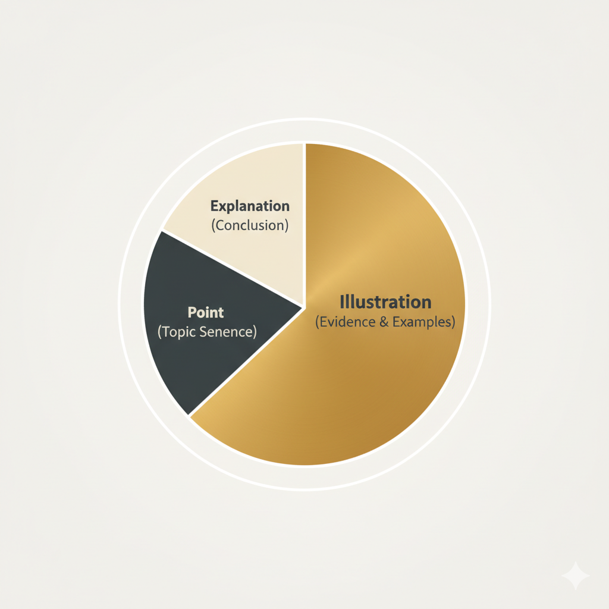

## The Anatomy of a Strong Paragraph
A paragraph is the fundamental unit of composition, a self-contained exploration of a single, focused idea. More than just a block of text, a well-crafted paragraph serves as a guidepost for your reader, leading them logically through your argument or narrative. The most effective paragraphs are built on a clear, stable structure. A simple but powerful framework to master is the **PIE method: Point, Illustration, Explanation.**

## P: The Topic Sentence (Point)
Every strong paragraph must begin with a **topic sentence**. This is the most important sentence of the paragraph as it makes the central **point** or claim. It's the promise you make to the reader, clearly stating what the next few sentences will prove or elaborate upon. A powerful topic sentence is assertive, clear, and specific. It is the anchor for everything that follows.

* **Weak:** *Paragraphs are an important part of writing.* (Too vague)
* **Strong:** *The topic sentence acts as a crucial signpost, dictating the direction and scope of the entire paragraph.* (Specific and assertive)

## I: The Body Sentences (Illustration)
The body of the paragraph exists to support and develop your topic sentence. This is where you provide **illustration**—the evidence that makes your point convincing. This can take many forms:

* **Facts and Statistics:** Hard data to support a claim.
* **Examples:** Specific instances that demonstrate your point.
* **Quotes:** Expert opinions or primary source material.
* **Anecdotes:** Short, relevant stories that bring your point to life.

These sentences must be directly and unambiguously relevant to the point made in the topic sentence. Each one should add another layer of detail or proof.

## E: The Concluding Sentence (Explanation)
The final one or two sentences provide the **explanation** and bring the paragraph to a satisfying close. This sentence has two key jobs:

1.  It summarizes the information and explicitly connects the illustration back to the main point, answering the "so what?" question.
2.  It often serves as a smooth transition to the idea that will be presented in the next paragraph, ensuring a seamless flow for the reader.

By mastering the PIE structure, you ensure that every paragraph you write is a focused, well-supported, and persuasive unit of thought.
